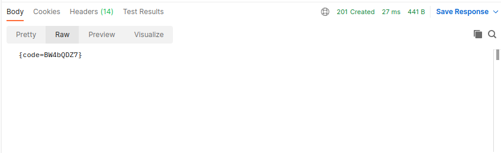

## job4j_url_shortcut
## Сервис - UrlShortCut

### Описание проекта

Проект представляет собой сервис, в котором пользователи (сайты) могут зарегистрироваться 
и для обеспечения безопасности зашифровать ссылки. По зашифрованным ссылкам можно отправлять GET запрос, в ходе 
которого происходит подсчет количества переходов. Сервис может генерировать отчет, который отображает все зашифрованные
сайты и количество перехеодов по ним.

### Использованные технологии
* Spring Framework 2.7.9
* JSON Web Tokens 4.3.0
* Collections Framework
* Lombok
* Checkstyle 3.1.2
* PostgresSQL
* Apache Commons
* Liquibase 4.20.0

### Требования к окружению
* Java 17
* PostgresSQL 15
* Apache Maven 3.8
* Postman

### Запуск проекта 

1. Установить JDK 17
2. Установить Maven
3. Установить сервер БД PostgresSQL,при установке задать имя пользователя - postgres, пароль postgres, порт - 5432
4. Установить Postman
5. Открыть postgresSQL при помощи команды в терминале:
   ``sudo -u postgres psql``
6. Создать БД url_shortcut и подключиться к ней   

7. При помощи терминала перейдите в папку с исходным кодом и выполните команду: ``mvn spring-boot:run``   

### Взаимодействие с приложением
 
1. Регистрация 
* Открыть программу Postman, отправить POST запрос с указанным URL и BODY в котором указать название сайта:  

* После отправки запроса придет ответ с BODY, в котором сгенерирован уникальный логин и пароль:  

2. Авторизация
* Отправить POST запрос с указанным URL и BODY, в котором указываем сгенерированный логин и пароль  

* В ответе BODY, будет находиться сгенерированный токен, с которым можно будет выполнять дальнейшие запросы  

3. Регистрация URL
* Перед регистрацией URL необходимо в Headers добавить колонку Authorization и в его значении указать ранее 
созданный токен:  

* Отправить POST запрос с указанным URL и BODY, с ссылкой, которую будем шифровать:  

* В BODY ответа получим уникальный код, который привязан к URL:  

4. Переадресация
* Чтобы перейти на сайт, необходимо отправить GET запрос и в строке ввести зашифрованный ключ, если сервис найдет
ссылку по ключу в базе данных то ответ от сервера будет HTTP CODE - 302:  

5. Статистика 
* Чтобы посмотреть все зашифрованные ссылки и количество их посещений необходимо отправить 
GET:  

## Контакты
vithag97@mail.ru 
